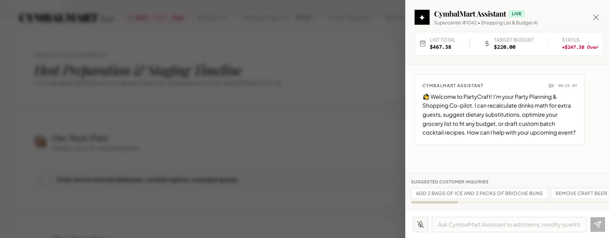
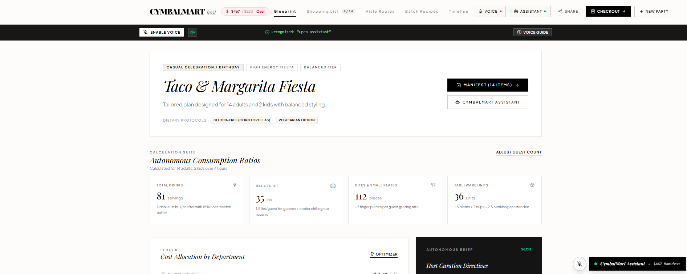
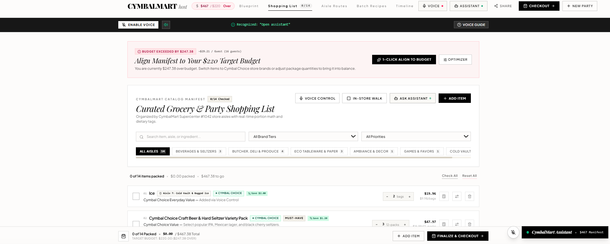
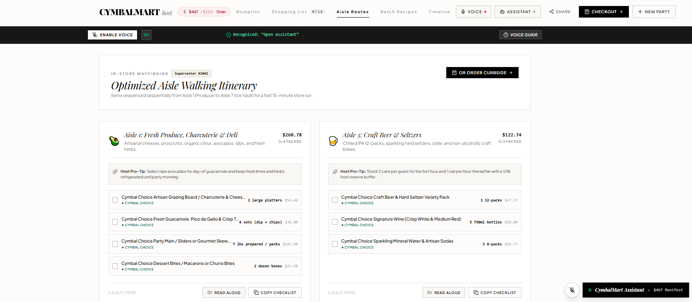
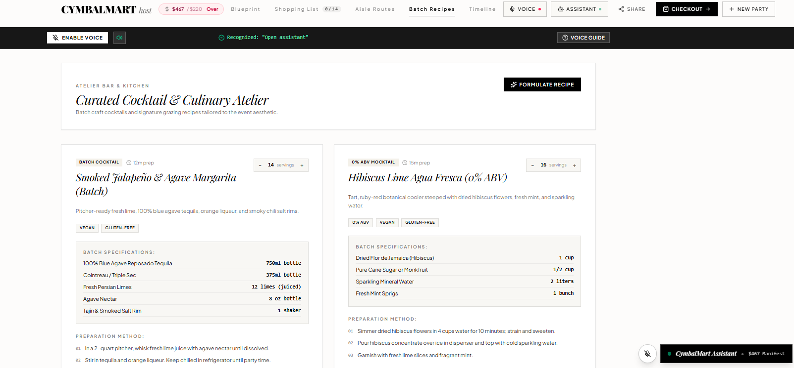
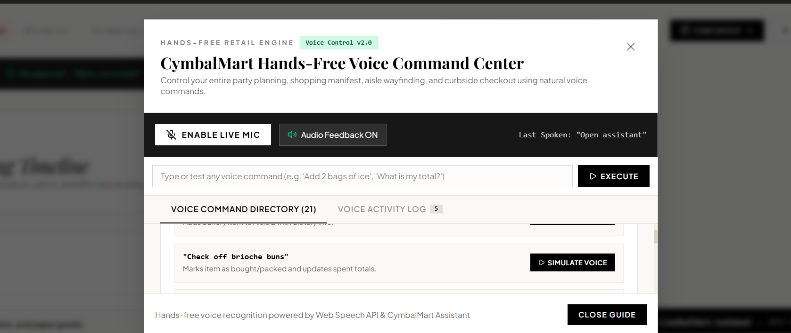
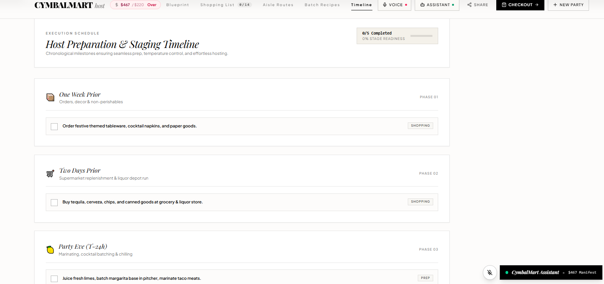

<div align="center">

# # CymbalMart Shopping Agent 🛍️✨

An intelligent, interactive party planning and shopping assistant designed to convert event requirements into curated, budget-conscious shopping lists with real-time adjustments and voice integration.

[](https://react.dev/)
[](https://tailwindcss.com/)
[](https://aistudio.google.com/)

</div>

---

## 🎯 Overview
Planning events can be stressful, chaotic, and hard to budget. **CymbalMart Shopping Agent** automates event curation by turning simple party requirements into smart, structured shopping lists with dynamic tracking and voice capabilities.

---

## 📸 Application Showcase & Features

### 1. CymbalMart Shopping Agent Dashboard
*The central hub where users initiate event curation, theme configuration, and guest count parameters.*
<br>


---

### 2. Interactive Shopping Mart Views
*Browse through curated store inventories and item selections tailored specifically to your event theme.*
<br>

<br>


---

### 3. Dynamic Shopping Lists & Budget Tracking
*Automatically updates expenses, quantities, and item availability in real time as modifications are made.*
<br>


---

### 4. Aisle Resources & Smart Navigation
*Organizes items by store aisles and resource categories to make physical or online shopping seamless.*
<br>


---

### 5. Batch Recipes & Curation
*Bundle recipes and ingredients efficiently for food and beverage planning.*
<br>


---

### 6. Hands-Free Voice Control
*Navigate menus, add items, and adjust parameters entirely hands-free using integrated voice commands.*
<br>


---

### 7. Event Planning Timeline
*Keep track of milestone tasks leading up to the event date to ensure nothing gets missed.*
<br>


---

## ✨ Core Features Summary
* **Smart Event Curation:** Instantly generates tailored shopping lists based on party type, theme, guest count, and specific budget constraints.
* **Interactive AI Assistant (`CymbalMart Assistant`):** A built-in conversational chat interface to help users seamlessly plan and modify their events.
* **Dynamic Budget Recalculation:** Automatically updates and recalculates total expenses and item quantities as changes are made.
* **Hands-Free Voice Control:** Integrated voice command capabilities allowing users to navigate and complete the planning process entirely hands-free.
* **Scenario Testing Support:** Pre-configured and validated for diverse use cases ranging from children's birthday parties to corporate team-building events and outdoor weddings.

---

## 🛠️ Tech Stack & Architecture

* **Frontend:** React, TypeScript, Tailwind CSS
* **AI Integration:** Advanced Large Language Model agent workflows and natural language prompting frameworks
* **UI Components:** Custom modular modals, dynamic list views, and responsive design systems

---

## 📂 Project Structure

```text
├── src/
│   ├── components/     # UI components (Modals, Chat Assistant, Lists)
│   ├── App.tsx         # Main application entry point & state logic
│   └── main.tsx        # React DOM render setup
├── public/             # Static assets
├── package.json        # Project dependencies and scripts
└── README.md           # Project documentation

💡 Author
Built with ❤️ by Hizba Nadeem Nazir


### Next Steps:
1. Paste this code into your `README.md` file in VS Code and save it.
2. Run your terminal push commands to update GitHub:
   ```bash
   git add .
   git commit -m "Enhance README with complete UI screenshots and visual showcases"
   git push origin main
